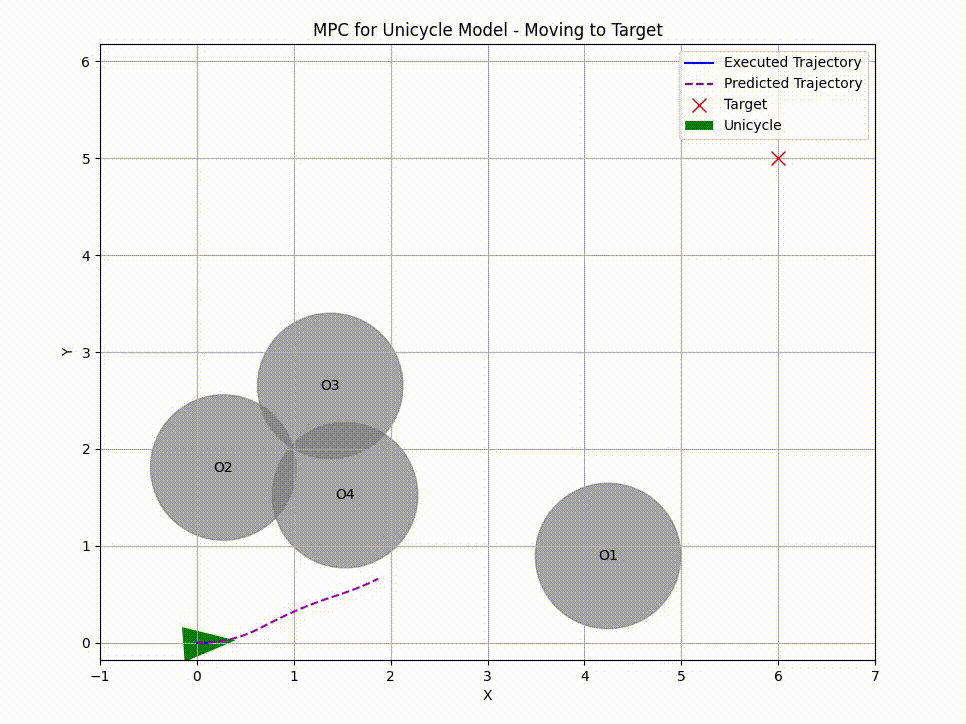

# Control Strategies for Space Debris Removal: Evaluating MPC vs. PID with Potential Field Approach

## Project Overview

This repository contains the ongoing research project for the Scientific Writing and Methodology course. The project focuses on comparing the performance of Model Predictive Control (MPC) and PID controllers combined with a potential field approach for real-time trajectory generation in space debris removal scenarios.

## GIF Comparisons

### Comparison of Motion Planning Methods

<table>
  <tr>
    <td><strong>Artificial Potential Field (APF) Control</strong></td>
    <td><strong>Model Predictive Control (MPC)</strong></td>
  </tr>
  <tr>
    <td></td>
    <td></td>
  </tr>
</table>


## Current Status

This project is currently in development. We are actively analyzing the effectiveness of MPC and PID control strategies in handling dynamic environments typical of space debris removal operations.

## Project Goals

1. Implement and compare MPC and PID controllers for space debris removal.
2. Integrate a potential field approach for real-time trajectory generation.
3. Evaluate the performance of these control strategies in dynamic space environments.
4. Provide insights into the most effective control methods for space debris removal operations.

## Repository Structure

- `/src`: Source code for MPC and PID controllers, and Artificial Potential Field (APF) implementations
- `/results`: Preliminary results and analysis (to be added)
- `/docs`: Project documentation and research notes (to be added)

## Installation

1. Clone the repository:

```bash
git clone https://github.com/davidenascivera/II2202_Project.git
```

2. Navigate into the project directory:

```bash
cd II2202_Project
```

3. Install the necessary dependencies:

```bash
pip install -r requirements.txt
```

## Usage

The primary scripts to run the simulations are located in the `/src` directory. To run a simulation, use one of the following commands:

For MPC simulation:
```bash
python src/MPC.py
```

For APF simulation:
```bash
python src/APF.py
```


## Contributors

- Davide Nascivera
- Lorenzo Fici

## License

This project is licensed under the MIT License. See the LICENSE file for details.
